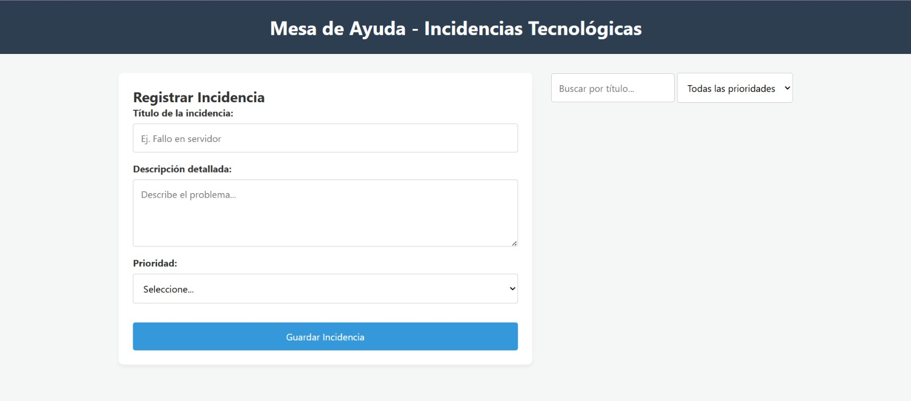
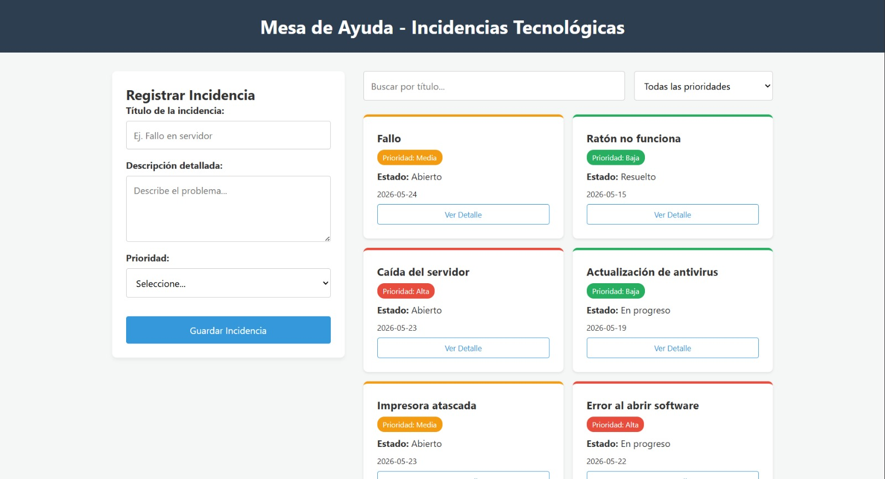
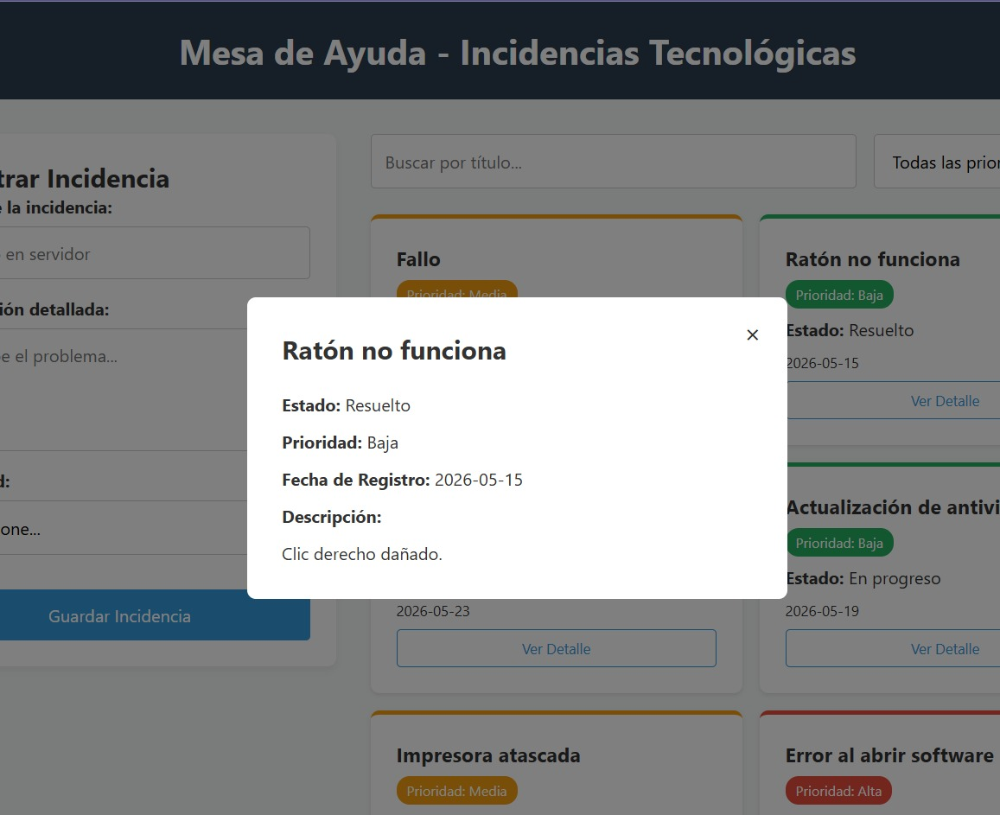

# Dashboard - Mesa de Ayuda e Incidencias Tecnológicas


Prototipo web interactivo para la gestión y seguimiento de incidencias tecnológicas (Grupo 8). Desarrollado aplicando JavaScript intermedio, manipulación del DOM y persistencia de datos local, sin el uso de frameworks externos.

## Tabla de Contenidos
- [Descripción del Proyecto](#descripción-del-proyecto)
- [Características Principales](#características-principales)
- [Capturas del Sistema](#capturas-del-sistema)
- [Estructura del Proyecto](#estructura-del-proyecto)
- [Instalación y Uso](#instalación-y-uso)
- [Autores](#autores)

## Descripción del Proyecto
Este sistema permite registrar, buscar, filtrar y gestionar tickets de soporte técnico. El enfoque principal está en la aplicación de métodos de arreglos (como map, filter, y find), validación de formularios y almacenamiento persistente en el navegador del usuario para asegurar una experiencia fluida.

## Características Principales
* *Renderizado Dinámico:* Generación de la interfaz mediante JavaScript basado en un listado de objetos.
* *Filtros en Tiempo Real:* Búsqueda combinada por texto y categorización por nivel de prioridad (Alta, Media, Baja).
* *Persistencia Local:* Uso de la API de localStorage para que la información no se pierda al recargar la página.
* *Validación de Datos:* Restricciones visuales en el formulario para asegurar la integridad de los registros antes de guardarlos.
* *Vista de Detalles (Modal):* Panel expandible para visualizar la información completa de cada ticket seleccionado.

## Capturas del Sistema

### 1. Interfaz Principal

Panel de control con el formulario de registro a la izquierda y la cuadrícula de incidencias dinámicas a la derecha.

### 2. Interfaz Principal con la lista de incidencias

Demostración del filtrado de tickets por prioridad y el manejo de errores en el formulario.

### 3. Modal de Detalles

Ventana modal que expone la información completa al hacer clic en el botón "Ver Detalle".

## Estructura del Proyecto

text
/app
├── index.html       # Estructura principal de la interfaz
├── styles.css       # Estilos, variables CSS y diseño responsive
├── app.js           # Lógica de negocio, eventos y manipulación del DOM
├── data.js          # Datos semilla (Seed data) iniciales
├── README.md        # Documentación del proyecto
└── capturas/        # Evidencias visuales del funcionamiento


## Instalación y Uso

1. *Clonar el repositorio:*
   ```bash
   git clone https://github.com/RTgo14/Actividad_01.git
   
2. *Abrir el proyecto:*
Dado que el código utiliza módulos de JavaScript (type="module" para separar la lógica de los datos), el sistema no funcionará haciendo doble clic sobre el archivo HTML debido a las políticas de seguridad (CORS) de los navegadores.

3. *Ejecución mediante Servidor Local:*

* *VS Code:* Instala la extensión Live Server y presiona "Go Live" sobre el archivo index.html.

* *Node.js:* Ejecuta npx serve en la terminal dentro de la raíz del directorio.

* *Python:* Ejecuta python -m http.server en la terminal.

## Autores
* Leiber Zambrano
* Michael Palma
* Christofer Barzola
* Blair Delgado
